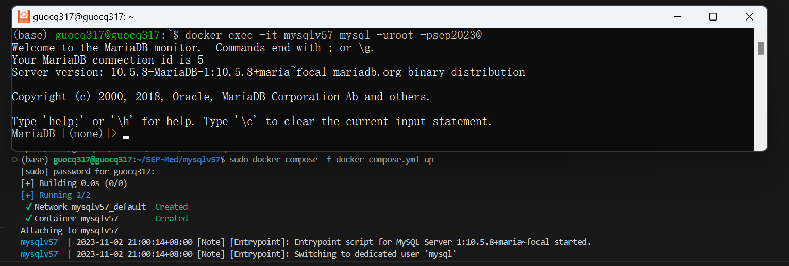

# SEP-Med
## 开发工具
- [VS-Code](https://code.visualstudio.com/download)

## 开发环境
- 使用 Anaconda 创建 ```python==3.11``` 的开发环境 ```dj_py311``` 
  - ```conda create -n dj_py311 python==3.11```
- 激活 ```dj_py311```
  - ```conda activate dj_py311```
- 安装 Django
  - ```python -m pip install Django```

## 本地部署 ```MySQL``` 数据库
  - 依赖 docker 与 docker-compose
    - [docker](https://docs.docker.com/engine/install/) 与 [docker-compose](https://docs.docker.com/compose/install/) 安装
  - 上述工具安装成功后，进入 mysqlv57 文件夹，依次执行下面的命令即可启动MySQL
    - ```mkdir {data,etc,logs,my.cnf}```
    - ```docker-compose -f docker-compose.yml up```
  - 本地即开启了 MySQL 服务，登录认证用户名为 ```root```，密码为 ```sep2023@```
  - 部署成功后会看到下面的图


## 时间安排
| 任务 | 开始时间 | 结束时间 | 交付结果 |
|:-|:-:|:-:|:-|
|数据库表结构设计与实现|2023/11/02|2023/11/05|包含表结构的sql文件|
|前端页面设计与开发|2023/11/02|2023/11/12|前端结果展示|
|系统功能与组件开发|2023/11/02|2023/11/12|系统开发源代码|
|联调测试与交付|2023/11/12|2023/11/14|开发文档及源代码|

## 中期沟通时间定在 2023/11/05，2023/11/08，有任何的问题，请随时联系。
